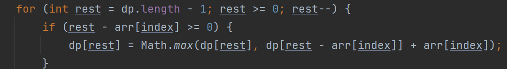

# Algorithm Learning
**算法学习 代码记录**  
方法论学习。
非LC代码均带有对数器验证正确性

### [Sort](./sort): 排序方法
- [冒泡排序](./sort/BubbleSort.java)
- [插入排序](./sort/InsertionSort.java)
- [选择排序](./sort/SelectionSort.java)
- [快速排序](./sort/QuickSort.java)： 荷兰国旗问题， 随机快速排序；递归 + 非递归版本
- [归并排序](./sort/MergeSort.java)：递归 + 非递归
- [堆排序](./sort/HeapSort.java)

### [链表排序](listSort/): https://leetcode-cn.com/problems/insertion-sort-list/solution/dui-lian-biao-jin-xing-cha-ru-pai-xu-by-leetcode-s/
- [链表的插入排序](listSort/InsertionSortList.java)： 
  - 空间O（N），额外使用数组 **【出错，arrayList拼接回链表后，忘记对最后一个节点的next指针，设置为空，造成环】**
  - O(1)空间复杂度， 在链表上进行节点的插入，设置多个变量。具体看代码和相关题解（数组的插入为O（N）因为要向后移，链表的插入为O（1），但是需要遍历为O（N），所以总复杂度不变）。 dummyHead（防止换头）， lastSorted，curr，prev
### [Heap](./heap): 堆
- [最大线段重合问题](heap/CoverMax.java)：题意见代码
- [堆的实现](./heap/HeapImplementation.java)：弹入，弹出，上浮，下沉
- [加强堆实现](heap/HeapGreater.java)：
  - 系统提供堆，缺少**反向索引表**（哈希表实现）。 这使得 即使我们更改了对象A的值，然后堆进行上浮下沉调整时，需要遍历数组才能找到A的位置，这个时间就需要O(N)。说白了，系统堆无法快速找到指定对象的位置。
  - 允许对堆内元素的值进行修改，加强堆会对修改后的元素进行调整，维持其大/小根堆的组织。其调整的时间复杂度仅为 O(logN)，上浮或下沉操作的时间复杂度
### [binarySearch](binarySearch): 二分法相关应用
- [二分法检测元素在数组的位置](binarySearch/BSExist.java): 为配合对数器检查，实现查找【等于区间最左元素】。
- [二分法 获取 >=N 的最左元素](binarySearch/BSNearLeft.java)
- [二分法 获取 <=N 的最右元素](binarySearch/BSNearRight.java)
- [二分法 无序数组，相邻元素不相等 求 任意【局部最小】](binarySearch/BSAwesome.java)

### 异或专题 -> 奇偶类问题： 异或即是无进位相加
- [Swap](xor/Swap.java)： 不创建额外变量进行两个数字的交换。
- [BitCounts](xor/BitCounts.java): 统计一个数字二进制中，1的个数. 异或方法： 【a & (-a) = 最右侧1】 + 再异或最右侧1，即可消除掉。（也可取反与） 
- [一个数奇数次，其他数字偶数次](xor/OddTimesEvenTimes1.java)：a^a=0; a^0=a
- [两个数字奇数次，其他数字偶数次](xor/OddTimesEvenTimes2.java)：全部异或后，结果为两数二进制中不同的位置。使用**【a & -a】**得到最右侧的1.从而区分。
- [奇偶进阶KM问题：arr中，只有一种数出现了K次，其他数都出现了M次](xor/KM.java): KM问题，M > 1,K < M。**O（1）额外空间复杂度。** 包含两个版本： 完整版（包含K次数字不存在情况）及精简版（数组元素严格遵循KM的出现次数）。

### [MergeSort扩展问题](mergeSortRelatedQuestions)：
```
都可以扩展为 数组中 每个元素 左侧范围/右侧范围 大/小 的相关问题， 
最终整合整个数组结果 的问题（但是注意，最终都要转换为类似，对于左组的**每一个元素**，
右组所满足要求元素的 **个数**）。思路：当问题问 关于数组中每一个数，右边怎么怎么样的时候， 
就可以往mergeSort上靠！ 本质：mergeSort把比较信息变成了有序的东西，这个有序的东西可以帮助很快的求很多事情。
```
- [小和 问题](mergeSortRelatedQuestions/SmallSum.java)：
  - **关注 【右侧范围】 有多少个数 比当前元素 大** ：给定一个数组，对数组中每个元素arr[i]，计算其左侧元素arr[j]满足(j < i && arr[j] < arr[i])的所有元素累加和，最终计算出整体数组对应的总累加和。每一个数左边比它小的数字之和 -》每一个数字右边有**多少个**比它大的数字。
  - 从左往右进行比较，左组元素拷贝的时候计算右组个数。注意：左右组相等时，先拷贝右边
- [逆序对问题](mergeSortRelatedQuestions/ReversePair.java)：
  - **关注 【右侧范围】 有多少个数 比当前元素 小** https://leetcode-cn.com/problems/shu-zu-zhong-de-ni-xu-dui-lcof/ 。从右往左进行拷贝，依然是 左组元素拷贝的时候，计算右组个数。注意：左右组相等时，先拷贝右边。
  - 【小和问题】 + 【逆序对问题】 -》 mergeSort过程中，只计算每一个元素作为**左组姿态**（123x|456789, 则对于x，456789将会是 x作为左组姿态下 遇到的右组总和），求右组的数量情况时，最终结果即为 在整个数组范围上，该元素 右侧所有元素的情况。**换句话说，该元素在 左组姿态的情况下， “456789”右侧【全部数字】 都会在 过程中的 【右组】中【仅有一次】的出现。**  
**下面的两个问题**，因为是【非元素本身】之间进行比较了，所以 将 【计算过程】 与 【Merge过程】 分开即可。
- [大于两倍问题 - BiggerThanRightTwice](mergeSortRelatedQuestions/BiggerThanRightTwice.java): 
  - Q： 求每一个数num 右边有多少个数*2之后 <num。**类似 逆序对 问题（一个元素 右侧范围中 小于当前元素个数），但是coding方式变了：** **小和问题和逆序对问题由于是直接比较，所以可以在merge左右组的时候 *同时* 进行计算**，而"大于右侧两倍"问题，**则只需要将 计算部分（for循环遍历左组，对于每一个【i】使用while循环找到满足条件的右组边界） 与 merge左右组部分 分开 即可**。  
  - PS：涉及一个技巧：双指针（指向左右组的开头） 不回退的技巧（因为左组有序，右组有序，所以必然不回退）， 时间复杂度O（N）。**说明一点：**不回退技巧**来自于 **单调性**（【单调性】往往伴随着【不回退】），因为左组小到大单调，右组也有序，所以比较左右组时可以不回退。
- [区间和的个数](mergeSortRelatedQuestions/CountOfRangeSum.java)： 
  - https://leetcode.com/problems/count-of-range-sum/ 。 
  - **转换为 必须以每个元素为结尾时，满足区间和的数量。** 转换为 左侧范围中，满足转换后区间和的元素数量。 =》 前缀和，单调性+滑动窗口+指针不回退技巧，关键点变成：求每一个元素**左侧范围**中满足 转换后区间和的数量。（mergeSort就是会让每个元素作为右组姿态下，在merge左组的过程中经历其左侧范围的每个元素仅有一次） 。  我要左侧的数字，那我就 遍历右组元素的时候，算左组个数。 
  - PS: 转换为 以每个元素为结尾，就变成了 求 左侧 的问题。 区间和 == 前缀和。  
  **【注意事项】** [注意前缀和数组值溢出问题](https://leetcode-cn.com/problems/count-of-range-sum/solution/qu-jian-he-wen-ti-qian-zhui-he-gui-bing-1u7x9/) !!! 题目给定 单个元素范围 【-2^31 <= nums[i] <= 2^31 - 1】，所以正常方式求 【前缀和】时 要使用【Long类型】进行存储。
### linkedList:链表相关问题（笔试时可以优先使用HashSet或HashMap来实现，面试时则使用额外空间复杂度为O（1）的方法。）
- [反转链表](linkedList/ReverseLinkedList.java)： 
  - 递归 + 非递归
- [删除给定值的节点](linkedList/DeleteGivenValue.java)：
  - 可能位于开头（分别考虑），可能位于中间。
- [链表 中位数](linkedList/LinkedListMid.java)： 
  - 快慢指针： 上中+中， 下中+中， 上中前+中前， 下中前+中前
- [是否是回文链表](linkedList/IsPalindromeList.java)： 
  - 判断一个链表value是否是回文的。回文代表 正着读反着读结果相同。O（N）栈，逆序。面试需 O（1）空间复杂度：取中位节点，后半部分逆序，头尾指针向中移动，沿途判断是否相等。
- [将链表中的数字 分为 【小中大】 三部分](linkedList/SmallEqualBigger.java)： 
  - O(1)额外空间复杂度，分成小中大三个list，总共六个首尾指针，最后进行整合
- [CopyListWithRandom,带有random指针的链表复制](linkedList/CopyListWithRandom.java)： 
  - O（1）额外空间复杂度：1 1‘ 2 2’ 3 3‘。
  - https://leetcode.com/problems/copy-list-with-random-pointer/
- [给出任意两个链表头节点，返回相交节点](linkedList/FindFirstIntersectNode.java)：此类问题笔试方法为HashSet，空间复杂度为O(N)。下列为面试方法，空间复杂度优化为**O(1)**。该大问题下包含以下四个小问题。
  - 【0】获得链表第一个入环节点（无则返回null）： 快慢指针 O(1)额外空间复杂度，快慢指针一起走第一次相遇时停止。slow不动，fast从head重走，此时slow,fast全部步长为1，第一个相遇节点即为相交节点。
  - 【1】两个无环链表相交节点： O(1)额外空间复杂度，通过两个链表最后一个节点判断是否存在相交。有的话，先走长链表多余部分，然后长短链表一起走，第一个相同节点即是相交节点
  - 【2】两个有环链表相交节点 ： 四种情况考虑：
    - （1）相交节点在非环部分 
    - （2）相交节点在同一个入环节点（12可合并） 
    - （3）两个链表的入环节点都在环上，但不同位置 
    - （4）无相交节点 
  - 【3】一个有环链表与一个无环链表不可能相交 
- [ReverseNodesInKGroup - K个一组翻转链表](linkedList/ReverseNodesInKGroup.java)：
  - https://leetcode.222com/problems/reverse-nodes-in-k-group/ 。 
  - 讲究代码设计，涉及到 链表反转函数设计（实现 给定head,tail的范围部分，实现链表反转）
- [AddTwoNumbers](linkedList/AddTwoNumbers.java)：
  - https://leetcode.com/problems/add-two-numbers/ 。 
  - 使用较长链表作为返回链表。 使用"%" + "/"计算当前节点值和进位值。 
  - **经历三个阶段**： 1.短链表走完 2. 长链表剩余部分走完 3. 最后元素是否有进位，决定是否创建新节点
- [合并两个有序链表-MergeTwoSortedLinkedList](linkedList/MergeTwoSortedLinkedList.java)： 
  - https://leetcode.com/problems/merge-two-sorted-lists 。
- [合并K个有序链表-MergeKSortedLists](linkedList/MergeKSortedLists.java)： 
  - https://leetcode.com/problems/merge-k-sorted-lists/ 使用优先级队列，小根堆

### QueueImplementation:队列实现
- [单链表实现队列](queueImplementation/LinkedListToQueue.java)： 
  - 尾插法 （先进先出，后进后出）: 在poll函数中，注意一个场景，当size==1时出队后，此时head==null,要同时调整tail=null。所以，**要在每次poll函数调用出队元素后中，检查是否head==null，从而决定是否调整tail.
- [RingArray数组实现队列](queueImplementation/RingArrayToQueue.java)：
  - offeri, polli, **size**控制offeri,polli之间的关系
- [两个栈实现队列](queueImplementation/TwoStackImplementQueue.java)： 
  - pushStack,popStack + pushToPop()保证只有当popStack为空时，就将pushStack中的所有元素全部pop到popStack中去

### StackImplementation:栈的实现
- [单链表实现栈](stackImplementation/LinkedListToStack.java)： 
  - 头插法 （后进先出，先进后出）.单链表实现队列也好，单链表实现栈也好，都要注意 push时，考虑 空(head==null)/非空 两种情况！！！ 并且size!
- [数组实现栈](): 
  - 不具体实现了。只需要一个变量size, size既表示 当前stack中元素数量，也表示要新插入元素的位置。 [0, size),push时，arr[size++] = value; 弹出时，return arr[--size]
  - 我们在并查集部分，数组实现并查集部分，就是使用 数组 实现的模拟栈。
- [一个队列实现栈](stackImplementation/OneQueueImplementStack.java): 
  - 入队元素前面所有元素 出队， 重新入队，从而实现后进先出
- [两个队列实现栈](stackImplementation/TwoQueueImplementStack.java)： 
  - queue和help， 引用对换
- [最小栈](stackImplementation/GetMinStack.java)：
  - https://leetcode-cn.com/problems/min-stack/ O（1）从栈中获得最小值. 创建两个栈，dataStack（存储原始数据），minStack辅助栈，所有 <= 栈顶的元素 都加到minStack中

### dequeImplementation:双端队列实现
- [双向链表实现双端队列+双端队列实现队列和栈](dequeImplementation/DoubleLinkedListToDeque.java):
  1. 单链表无法实现 双端队列（尾部出无法实现）
  2. 双向链表 实现 双端队列 需要满足要求： （1）Node具有前后指针 （2）双端队列CLASS具有 **头尾指针**
  3. 实现栈： 从头处 入栈，出栈 =》 push->offerFirst, pop->pollFirst
  4. 实现队列： 队尾入队，队首出队 =》 offer->offerLast, poll->pollFirst  
***下列对于上述的 单链表的栈实现和队列实现一并适用，犯过错！***
  5. **!!!依然是关于头插法，尾插法； 但是要记住，头插法尾插法 都需要 额外讨论【head==null】的情况**   
     =》分情况讨论 =》  
     **第一种情况分支： head == null时，执行head=cur,tail=cur;   
     第二种情况分支：head != null，执行头插或尾插法**
  6. 往外出元素的时候 poll()方法/pop()，一定要先检查 当前数据结构是否为 empty了 =》 可以用 **if (head==null) {}** 来检验是否当前为空。 此外，注意 head==tail时 弹出元素的情况，分类讨论。

### 二叉树： 灵活运用递归序
- [递归遍历二叉树](binaryTree/RecursiveTraversalBT.java)： 递归序，任何节点都会到达自己三次。 前序，中序，后序 就是按照 递归序中 第一次到达，第二次到达和第三次到达的时机 进行节点value的打印。
- [非递归遍历二叉树](binaryTree/UnRecursiveTraversalBT.java)： 前序，中序，后序。具体注释见代码。
- [层序遍历](binaryTree/LevelTraversalBT.java)
- [层序遍历确定每层节点](binaryTree/LevelTraversalBT.java)：用以实现 层序遍历的过程中 的 分层打印。 只需要添加两个变量curEnd + nextEnd;
- [二叉树最宽的层有多少个节点](binaryTree/TreeMaxWidth.java)
- [序列化与反序列化二叉树](binaryTree/SerialiseAndReconstructBT.java)： 【本质都是用队列，存储节点序列化的值】二叉树可以通过先序、后序或者按层遍历的方式序列化和反序列化，但是，二叉树无法通过中序遍历的方式实现序列化和反序列化。 -> **关键就是，序列化字符串的遍历结果中，包含null表示空节点。** （从而就可表示唯一的二叉树，并支持反序列化，在deserial时，遇到"null"直接返回null，不再新建节点）
- [EncodeNaryTreeToBT](binaryTree/EncodeNaryTreeToBinaryTree.java)：https://leetcode.com/problems/encode-n-ary-tree-to-binary-tree . 将N叉树 序列化为 二叉树，并能够反序列化。 解法：将N叉树的每个节点的所有孩子（List<Node> children），转化为 二叉树中对应节点的 【左树右边界】。
- [二叉树的后继节点](binaryTree/SuccessorNode.java):【错题】二叉树节点拥有指向父节点的指针，给定任意一个节点，求中序遍历的后继节点
- [paperFolding](binaryTree/PaperFolding.java)：折纸问题，假象二叉树进行中序遍历打印（并且能够使每个节点的左右孩子 按照要求进行打印，例如 左孩子打印“凹”，右孩子打印“凸”），递归思想很经典，值得复习。  
    此方法能够 实现 假象当前来到一个头节点，左孩子为0，右孩子为1的 打印出 前序，中序，后序节点。 能够按输入的层数，进行满二叉树的结果打印。

### 二叉树的递归套路： 树型dp。 本质就是 左右子树的信息整合， 后序遍历
- [判断完全二叉树](BTTraversalQuestions/isCBT.java)：【中等难度，复习】CBT（堆就是完全二叉树）：对于一层而言 1.要么这一层是满的 2.如果不满，那也必须最后一层不满，即便最后一层不满，最后一层也是必须从左到右依次变满的
- [判断平衡二叉树](BTTraversalQuestions/isBalanced.java)：平衡二叉树是指，对于任何一个节点，左树和右树的最大高度相差的绝对值 不大于1 （<=1） && 左右子树也都是平衡树；
- [判断是否是满二叉树](BTTraversalQuestions/isFull.java)
- [判断二叉搜索树](BTTraversalQuestions/isBST.java)：**该题包含上游 对 返回null的处理，我自己进行了代码优化，可以反复看一看加固记忆。**
  **树型dp：目标结果考虑： 与X有关（以X为头节点的最优解），与X无关（左子树，右子树有最优解） 两种情况影响最终要求的结果，这是分析的起点**
    ```
    (1)只有最后要求的答案那个的INFO中的属性，在process中是最后求得，其他属性先求，并且好求。并且！，例如公共祖先问题，ancestor的求解会用到 先求出的 containsA和containsB！
    (2)特别注意process中的 base case： 如果可以直接返回new Info()，那么正常处理即可；如果包含诸如max,min之类的，那么返回null，则在上游，要特殊处理null的问题。可以多看看代码。
    (3)对于null 的处理分为两种：   
        【1】对于(int max, int min)类型，首先将max设为当前结点的值max=cur.val，然后if (left != null) {max=max(max,left)}； 接着if (right != null) {max=max(right,max)}
        【2】对于 (boolean isBST)类型，可以依据满足BST的条件 定义多个boolean 变量（这几个boolean变量都满足，则isBST=true），每个变量赋值中，进行空判断，如果为空则返回true，不为空，则left.max<cur.val的结果返回。（具体看isBS后面相关代码）
    ```    
- [最大二叉搜索子树的大小](BTTraversalQuestions/MaxSubBSTSize.java)
- [最大二叉搜索子树的头节点](BTTraversalQuestions/MaxSubBSTHead.java)
- [二叉树中两个节点之间的最远距离](BTTraversalQuestions/MaxDistance.java)： 【关键】判断两种情况： 当前节点X， 1.与节点X有关 2.与节点X无关（最大距离 在 左树/右树）
- [最近公共祖先](BTTraversalQuestions/LowestAncestor.java): version1: 给定两个节点进行对比; v2:给定两个值进行比对，二叉树中每个节点的值都不相等
- [派对的最大快乐值](BTTraversalQuestions/MaxHappy.java): 【经典，dp，学习】
- [二叉树的最小深度](BTTraversalQuestions)： 【面试，错题】当时做错了，很简单的递归套路，但是 要考虑到 左右子树为0时，Math.min()，不可取双边。需要单独讨论，left 与 right，为0情况下，不同的返回值。

### 贪心算法 : 解法上基本都是 **【排序】（使用比较器）或【堆】（使用哈夫曼编码/ 大根堆配合小根堆）**
```
    (1)贪心算法就是 通过 【取得每一个步中的局部最优（这个局部最优就是制定的贪心策略）】， 【最终组合起来就是 全局最优解的方法】。所以贪心策略也有可能就是错的。
    (2)该算法 存在 错误的概率，所以 是一种类似于猜的算法。
    (3)虽然在大多数情况下是有用的，但是 我们想要知道 贪心算法 是否是可行方案时， 只要我们能够举出一种反例（意思就是局部最优，无法组成全局最优），那么就说明 该问题使用贪心算法无效。
   ```
- [给定一个由字符串组成的数组strs，必须把所有的字符串拼接起来，返回所有的拼接结果中，字典序最小的结果](greedyAlgorithm/LowestLexicography.java):字典序就是java里面字符串的排序方式。
- [会议室的最佳安排](greedyAlgorithm/BestArrange.java)(具体题目都写在MyBase中): 排序， 以结束时间早晚排序 为 贪心策略
- [Light](greedyAlgorithm/Light.java): 分析放灯的情况，选择最贪心的位置进行放灯（比如说 三个位置 灯放中间）
- [IPO](greedyAlgorithm/IPO.java): 
  - Initial Public Offering(首次公开募股). https://leetcode-cn.com/problems/ipo/ . 
  - 大小堆。 小堆：按成本排序。 大堆：可以购买的项目中，按profit排序。
  - 策略： 每次都现根据cost在可以选择的项目中，选取profit最大的。最后到达K个项目，结束。
- [最小代价分割金条](greedyAlgorithm/LessMoneySplitGold.java): 哈夫曼编码，堆。 策略：【每次选最小的两个合并】，然后组成新的数组。每次合并就是成本。最终合并成只有一个数字的时候，即得到最终答案。
### 并查集: 图的连通性问题， 集合合并数量问题。
```
如果你一开始所有的样本量是N， 只要你 findHead 这件事情，它的调用次数 到达了O（N）或超过了O（N）（足够频繁），那么单次均摊下来，查询代价O(1)。他有可能某一个时刻花费时间非常长，但是均摊下来非常省。
说白了，并查集，查询只要到达了样本量这个规模，单次非常的快，就是O（1）.
```
- [并查集实现-哈希表](unionFindSet/UnionFindSet.java): 哈希表实现用于理解，具体做题实现用数组，常数时间小。
  - 建立三个关系映射表：【1】普通元素到包装成对象的节点的映射（从而可以避免元素相同值的问题，转换成对象是为了使用不同对象的地址值各不相同，从而区分每一个节点） 【2】parent表 【3】size表。 
  - 关键点就是 围绕 代表节点（findFather-任意节点的代表节点的查找，isSameSet-判断两个节点代表节点是否相同，union-将小size的代表节点挂到大size的代表节点下面）。
- [朋友的圈子/省份数量](unionFindSet/NumberOfProvinces.java):
  - https://leetcode-cn.com/problems/number-of-provinces/ . 
  - 数组形式实现并查集。
- [岛屿数量I](unionFindSet/NumOfIslands.java): 
  - 测试链接：https://leetcode.com/problems/number-of-islands/
  - 【1】DFS 【2】并查集（每个位置与左上进行检测） 数组形式实现的并查集 + 哈希表实现的并查集
- [岛屿数量2](unionFindSet/NumberOfIslandsII.java): 数组形式实现并查集。
  - https://leetcode.com/problems/number-of-islands-ii/ （付费题） 代码中实现了对数器用于检验正误. 
  - 给定m和n作为二维数组的row和col。 再给定一个数组positions=[[0,0],[2,1]..]，假设对positions执行addLand操作，依次将数组中的位置设置为1，要求返回 每次addLand后的岛屿数量，以List式返回
  - 动态添加1的位置并进行合并（要求添加一个检查合并一次，返回sets结果） ==》 使用并查集
  - 并查集支持动态添加节点
- [岛屿数量2问题的补充问题](unionFindSet/NumOfIsLandsIIExtra.java): 如果m*n比较大，会经历很重的初始化，而k（positions.length）比较小，怎么优化的方法  =》 字符串拼接+哈希表实现（哈希表只存储有效节点，不会像数组一样存储全部位置），而K比较小，使得虽然哈希表常数操作大，但是总的次数比较少，所以性能损耗小。

### 图：
- [图的生成](graph/GraphGenerator.java)：
  - 根据给定的邻接矩阵，邻接表或者 [[weight, fromNode, toNode], []]这些方法，转换成空间感强的图结构。
  - 该生成图的结构包含以下部分，可以将其他表示方法转化成该表示方法： 
    - Graph： 点集（哈希表实现）: HashMap<Integer, Node> -> <区分值，顶点Node>； 边集 HashSet<Edge>
    - Node: 顶点代表值（用以区分节点的值） int, 入度 int, 出度 int, 孩子节点List ArrayList<Node>, 从该点出发的边List ArrayList<Edge>
    - Edge：权值 int， 起始节点Node fromNode, 终止节点Node toNode
- [BFS](graph/BFS.java): 相较于二叉树的BFS，多添加一个set，防止重复元素进入队列即可（防止环路）。
- [DFS](graph/DFS.java): 非递归实现（栈（模拟系统栈） + set（防止环路重复元素）），入栈时打印
- [拓扑排序方法](graph/TopologySort.java): 
  - DAG有向无环图。 首先从入度为0的节点入手，拓扑序置于前面。然后将节点移除，再次检查拓扑序为0的节点。
  - inMap(入度表)， zeroInQueue(当入度值为0时，入队)
- [拓扑排序，lintcode原题](graph/TopologicalOrder2.java)： 
  - 它给的就是节点，你无法再自创节点
  - 三种解法: [DFS【点次】](graph/TopologicalOrderDFS1.java) + [DFS【深度】(推荐使用)](graph/TopologicalOrderDFS2.java) + [BFS【统计入度，建立入度表，依次减少入度值】](graph/TopologicalOrderBFS.java)（BFS就是建立入度MAP，依次将入度为0的节点添加到排序列表中） + 记忆化搜索（map设置缓存）
  - DFS思路大体是，【1】如果 a节点图中节点【点次】>b，那么拓扑序中a<b  【2】深度： a > b,那么拓扑序上 a < b； 
  - 对于上述思路的补充，如果遇到此题，DFS方法下使用 【深度】的概念。因为如果用【点次】概念存在两个问题：1.节点数量要用long类型 2.比较器处要使用判断语句返回 0，-1，1，不然会报错。只有满足1，2点，方可PASS。
  - https://www.lintcode.com/problem/topological-sorting

**最小生成树(Minimum Spanning Tree)算法针对无向图。undirected graph only。【图的最小路径和问题】**
- 最小生成树算法1：[Kruskal算法](graph/Kruskal.java): 
  - 实现1：本package中的graph定义解法，贪心算法小根堆 + 并查集（HashMap实现） + 遍历边集全部边进小根堆。
  - 实现2：也可用于二维数组定义的边集,方法与上述相同（依据情况，可以考虑使用数组实现） =》边集数组形式：[[weight1, from1, to1], [weight2, from2, to2]]
- 最小生成树算法2： [Prim算法](graph/Prim.java)：
  - 实现1：本package中的graph定义解法：贪心算法小根堆。 点解锁边，边解锁点，依次解锁。
  - 实现2：邻接矩阵，数组形式实现Prim （复杂一些）
  
- [最短路径算法-Dijkestra](graph/Dijkestra.java): 基于package的Node，Edge定义的解法。
  - 方法1最优解(面试，代码较多)：
      - 使用 加强堆 实现 Dijkestra算法
      - 时间复杂度 O(M * logN) ==》 N为节点数量， M为边的总数量
  - 方法2（笔试，代码合理且时间满足）：
      - 仅使用 PriorityQueue实现，通过添加 HashSet<> visited 判断 节点是否已经被锁住（被访问过了）
      - 时间复杂度 为 O(M * log M) ==》 N为节点数量， M为边的总数量
    使用系统提供小根堆 + boolean数组 
      -整合：boolean 数组用作 确定哪些节点已经被选择; 用 HashSet也可以，但是哈希表常数时间很大

- [x到Y的最短路径](graph/XToYMinDistance.java): dijkstra算法附加问题。 该题是针对【邻接矩阵】的解法。在邻接矩阵中，我们使用系统最大值表示无边。本题使用三种方法实现。
  - 【1】暴力DFS解法，递归实现.所有路径中最短的路径和。
  - 【2】Dijkstra 面试方法。 加强堆 实现的过程中，【错误点】因为是矩阵，所以无效边使用系统最大值表示。在由选定节点更新相邻边时，需要加入if语句，只有当边存在时（非最大值）才可以更新record。
  - **两个注意事项**！：
    - 1) 不要忘记比较时候比较的是对象的.distance属性，不是heap[i]<heap[(i-1)/2], 而是 heap[i].distance < heap[(i-1)/2].distance
    - 2) 记得及时调整 indexMap： 三个地方： 1) swap时，对换indexMap； 2）offer时，新元素插入末尾位置，更新indexMap; 3)弹出元素时，将indexMap对应值 设置为 -1，表示进入过但是已经不在堆中
  - 【3】Dijkstra 笔试方法。 PriorityQueue + boolean数组记录已经选中的点。 笔试面试方法都需要创建 Record对象，将 (node,distance) 两个属性封装在一起。每个Record节点表示当前起始点到node的距离是distance。（面试方法中为每次确定新节点后的最小distance，而笔试方法是随着新节点的确定，生成所有record全部放入小根堆）

### 经典递归
- [汉诺塔问题](classicRecursiveMethod/Hanoi.java)

- **【从左往右的尝试模型】**
- **数组上做 深度优先遍历。 递归参数 - 添加 index，表示位置，每次递归，位置+1 / 添加 List<String>，当到达base case时表明该路径已经完结（深度优先），于是加入到List当中。** Base case 为 index==arr.length， 此时即为到达某一结尾节点时的深度遍历结果。
  - [字符串的全部子序列](classicRecursiveMethod/PrintAllSubsequences.java): DFS。 由于需要记录前面路径的信息，所以添加String path参数
    - 子序列指的是**可以不连续的字符元素组合**。
    - 使用 【递归中的递】来解决问题，深度优先遍历。 对应 从左到右的尝试模型（每一个index要或不要，将结果记录并传给下一个节点）。这种方式需要较多的参数，但是更符合动态规划的尝试模型。
    - 该方法不同于单纯解决问题的递归，多练几次，重复记忆，多多理解，加深理解这种方式的递归，类似于二叉树（**向下传递的递归，向下传递的递归就需要记录当前的值并传给下一个递归节点，所以这个就多一个参数**）。
  - [打印一个字符串的全部子序列，要求不要出现重复字面值的子序列](classicRecursiveMethod/PrintAllSubsequencesNoRepeat.java): 将process()递归函数中传入的List变为**Set**，从而去重、
  - [字符串的全部排列](classicRecursiveMethod/PrintAllPermutations.java) : DFS。 一个位置选择一个字符，剩下位置排列剩下字符。记得恢复现场。 ！！由于不需要记录前面信息的情况（信息全部存储在char[] str本身），**【所以不需要添加 存储前面遍历节点信息的变量】**。
    - 用到的重要技巧： 牵扯到 递归里面，尤其是【深度优先遍历】里面很重要且常见的技巧，叫做 **【恢复现场】即改变了现场之后，退出递归时再还原现场，从而不影响到兄弟递归**。
    - 递归函数 - 排列所有的元素。 分解成子问题：将当前位置依次选一个元素，然后剩下部分全排列。 + 恢复现场
  - [字符串的全部排列-去重版本](classicRecursiveMethod/PrintAllPermutationsNoRepeat.java): 
    - boolean[256]数组，实现【剪枝】 递归方法中的最优解
    - https://leetcode-cn.com/problems/zi-fu-chuan-de-pai-lie-lcof/ 。
- [给你一个栈，请你逆序这个栈，不能申请额外的数据结构，只能使用递归函数](classicRecursiveMethod/ReverseStackUsingRecursive.java):
  - 设计两个递归函数： 【1】从栈底移除元素并返回，剩余部分栈中位置不变 【2】逆序整个栈； 【2】号递归函数里面使用到了【1】号递归函数
  - 这里给出递归函数的设计，代码见具体文件：
      ```
    【2】号主递归
    主的调用函数： 逆序栈内元素
    分解子问题：   【1】从最底端将元素移除并返回（使用【1】号递归函数），记录在变量a里面
                    【2】递归剩余部分（实现剩余部分的逆序）
                    【3】将a变量存的元素，压入堆顶
    Base case: 因为返回值是void，所以base case情况下，不需要返回值。所以可以直接将 stack.isEmpty()作为base case.
   
    【1】号次递归
    函数的功能是： 参数：传入一个栈； 实现功能：将栈底元素移除并返回。
    问题分解为子问题：  1）栈顶元素弹出，
                        2）递归调用剩余部分（栈底元素移除并返回，使用变量接住），
                        3）栈顶元素重新压入
    Base case: 查看返回值，为int类型（含义是栈底元素的值）。 如果以stack.isEmpty，则无法返回。
               题目想要的是栈底元素的值，所以我们可以先弹出元素，然后查看此时stack是否为空，为空，则返回弹出元素（栈底元素）的值；否则，按照普通递归情况处理。
    ```

### 暴力递归到动态规划
#### 从左往右的尝试模型
- [RobotWalk - 机器人走路的方案数](dp/RobotWalk.java): 剩余步数K， 一步一步减小，最终为0.
  - 总共N步，对于当前步数位于i，则下一步为i+1，直至i==N+1;【从左至右的递归】
  - 【错误点】递归函数的base case处理情况错误，具体情况见代码。 总结：在base case条件分支中，其含义只是能够直接得到答案的终止条件，但是 其返回值以及这个case都要满足process递归函数本身的含义。这样才能保证正确。   +   dp[][] 返回值需要的参数不要弄混了
  - 第三种方法： 进一步优化： **空间压缩** -> 一维数组
- [背包问题](dp/Knapsack.java): 货物数量K(0~K-1)，从左至右一个一个检查，最终i==K;
  - https://www.lintcode.com/problem/125/
  - i 为数组对应的下标。 对于每一个i，可以选择 要/不要，直至i==N，【从左至右的递归】。并且，【要和不要】不是死的，很多时候是要判断 是否能够 【要或者不要】。
  - 空间压缩 -> 一维数组
- [把数字翻译成字符串](dp/ConvertToLetterString.java): 
  - https://leetcode-cn.com/problems/ba-shu-zi-fan-yi-cheng-zi-fu-chuan-lcof/ . “把数字翻译成字符串”
  - 对于每一个i或（i, i+1）的pair，直至 i == N， 从左至右的递归
  - 【错误点】 1) base case 返回值。 并且经尝试，base case 必须是 i==length，不能是i==length-1。 返回值要为1.
  - 【错误点】 2) 在暴力递归转动态规划的过程中，if else 没有理清楚。 暴力递归可以不那么清晰写if-else是因为有些if语句中有return语句。 而改成动态规划的过程中，因为没有返回return了改成了dp[i]，由于只允许走一条分支，所以必须补上 if - else；说白了，创建条件分支结构时，没有必要非要省if-else，先保证结果的正确性
- [贴纸拼词](dp/StickersToSpellWord.java): 
  - 初始时，输入字符串String s, 每经过一次贴纸， 就变成了 s-sticker，最终变为 ""空字符串，从左至右的尝试。
  - 无法使用dp，使用 记忆化搜索即可达到最优解。化(用词频
  - 核心： 【1】字符的减法 使用 词频统计来进行减法。 **关键优表替代贴纸数组)**
  - 【2】针对单一变量 为 String类型， 做到 记忆化搜索即可，使用哈希表进行存储,傻缓存。
- [整数拆分问题](dp/SplitNumber.java): 
  - 给定一个整数N， 求裂开的方法数。
- [最小路径和](dp/MinPathSum.java):
  - 暴力递归
  - 快速转换dp
  - 空间压缩，二维转一维


#### 范围上（缩小范围）的尝试模型 ： 特别在意讨论 【开头如何如何，结尾如何如何】 + 开头与结尾共同的可能性/ **左下半区不需要考虑，无效**
- [CardsInLine - 纸牌博弈问题](dp/CardsInLine.java):
  - https://leetcode-cn.com/problems/predict-the-winner/
  - 博弈问题，先手后手问题，涉及两张dp表。 官方解答可以优化成一张dp表
- [最长回文子序列](dp/LongestPalindromeSubseq.java):
  - https://leetcode-cn.com/problems/longest-palindromic-subsequence/
  - 暴力递归： 【错误点】str[i] == str[j]时， return 【2】 + process(剩余部分)。 这里主要要加2，因为确定了两个子序列的字符。当时没想清楚直接写了1. 注意这个小错误。
  - 二维动态规划
  - 一维数组动态规划： 空间压缩。 最优解。  多多复习，如何改的。
- [跳马问题](dp/HorseJump.java): 三维表
  - 从棋盘(0,0)出发，到指定点(x,y)，在K步走到 的方法数

#### 多样本位置全对应的尝试模型 ： 特别在意讨论 【两个样本】的【结尾/开头】如何如何
- [最长公共子序列](dp/LongestCommonSubsequences.java):


#### 寻找业务限制的尝试模型:
```
(1) 如果递归参数中，有一个可变参数的范围你不知道，那么就按照最差情况看一下能够冲多大，来估计范围
(2) 很重要！： 一定要关心 **哪些范围是不需要填的** （有些位置 一定不会被递归调到，从而也无法计算，从而也不用填）。
```
- [咖啡机的最短时间](dp/Coffee.java):
  - 当可变参数模型估计不出来时，那业务最差情况估计（某些情况下拿平凡解估计）
  - 因为dp是 严格表结构的东西，不一定递归里面都会调用到，一定要关心哪些位置是不需要的，不需要的位置不需要填。 
  - 分为两个问题： 【1】贪心算法+小根堆（以完成时间最早为指标）   【2】记录每一个顾客最早喝完咖啡的数组后，从左往右尝试模型，每一个咖啡是wash OR air.
#### 斜率优化（优化枚举行为）
- [给定一个整数n， 求裂开的方法数](dp/SplitNumber.java):
  - 方法1： 暴力递归。 并且增加了一个功能： 将 满足条件的路径 使用回溯法 添加到list里面，从而可以查看结果的正确性
  - 方法2： 普通 暴力递归改dp
  - 方法3： 斜率优化版本， 将【枚举行为】 变为 有限个元素的计算
  - 方法4： 斜率优化 + 空间压缩 =》 减少时间复杂度，并将二维dp表压缩为一维dp表
  - PS: 代码中 有一个剪枝操作，应为【for (int i = index; i <= rest; i++)】，我在原答案中没有更改这个点，但是在暴力递归部分标注了出来，复习时候注意这个错误点并搞清楚为何可以剪枝。
  - 此外，还有一个剪枝点，就是 整个数组的左下半部 不需要 计算

#### 货币面值系列问题（各有侧重点，循序渐进， 状态压缩类型题）
- [CoinsWayEveryPaperDifferent](dp/coinsSeries/CoinsWayEveryPaperDifferent.java):
  - 求方法数  
  - 数组中包含重复元素，认为相同值的元素都是不相同的。
  - 背包问题
- [CoinsWayNoLimit](dp/coinsSeries/CoinsWayNoLimit.java):
  - https://leetcode-cn.com/problems/coin-change-2/
  - 求方法数
  - 数组中面值不同，每种面值都认为有无穷张，相同面值看做相同元素
  - 特别注意，状态压缩之后，有可能，随着位置依赖的改变， dp表的更新方向也会发生改变。不然会出错！！！
  - 单纯空间压缩时，不需要改变 for 循环顺序
- [CoinsWaySameValueSamePaper](dp/coinsSeries/CoinsWaySameValueSamePapper.java):
  - 求方法数
  - 数组中有重复值，重复值认为是相同的纸币
  - 综合前两问的最后进阶一问
  - **【错误，中上】** 很多错误点，全部代码中函数waysDpPro标注，集中在 进行 状态压缩+斜率优化上面，注意复习重做
  
- [MinCoinsNoLimit](dp/coinsSeries/MinCoinsNoLimit.java): 最少的硬币个数
  - https://leetcode-cn.com/problems/coin-change/
  - 【错误点】 1. 题目要求 无效返回-1，我却 直接将 自己设置的无效值返回，没有进行判断
  - 【2】很重要的一点：**在从递归 改成 状态压缩，空间压缩的过程中。 注意 如果递归中出现无效值的判断，那么 改之后的dp 不仅要对 下标边界进行判断，还要对 递归中对无效值的判断 进行判断，千万不要漏掉！！**
  - **【3】此外，一定要注意有效无效的判断: 在 base case中的 无效值，要与 正常情况下 也会产生的 默认值 （设为无效值），两者无效值要相同。 这样才能对每一个位置 做出准确的是否有效无效的判断。 建议都设为 MAX_VALUE， 或者 MIN_VALUE；详情见 LC上的错误提交**
-------------------------------------------------

最接近目标值的子序列和系列问题： 一定要注意，动态规划解法 必须 都是  正数数组！！！！ 负数的是别的题目和解法
- [SplitSumClosed](dp/splitSumClosed/SplitSumClosed.java):
  - 分成两个数组，使两个数组之间的绝对值最小
  - 【错误点】  直接进行 状态压缩的过程中，没有结合递归 在比较时加上arr[index]。 原因： （1）递归中有效无效没有clear 很清 （2）一定要 搞明白递归中有效无效的处理情况，从而在dp表中，有效是 如何处理。因为有时不仅仅是单纯拿该值，有时还要在该值上进行 加减别的值。

- [SplitSumClosedSizeHalf](dp/splitSumClosed/SplitSumClosedSizeHalf.java):
  - 分成两个数组，要求两个数组的长度相同，且实现 两个数组的差的绝对值最小
  - LC为偶数情况。 代码中也实现了 针对任意奇偶输入的 实现方法，
  - 为了快速写的话，可以直接 转dp，因为有时三维表不好看


#### 概率类问题: 因为组合数（或称为满足要求的 数量）可能存在很大的情况，记住使用 【long类型】的dp数组或【double类型】的【数组】和 【变量】 来存储最终的满足条件的 数量。 / 最终结果不要忘了 转 (double)
- [ “马”在棋盘上的概率](dp/KnightProb.java):
  - https://leetcode-cn.com/problems/knight-probability-in-chessboard/
  - 两种方向：【1】统计马在边界外 【2】统计马在边界内。 【1】需要对边界外的情况进行剪枝，需要额外计算 【2】直接计算递归返回的个数即可
  - 选择【2】，将问题转化成，** K步之后，马留在棋盘内的 次数**
  - 【错误点，卡了很久】： int（+-10^9）和long(+-10^18)都不够大，要使用**double类型**才可以 包含 累加起来的和

- [BobDie](dp/BobDie.java):
  - 直接计算 Bob 存活的 次数， 除以总的可能性 Math.pow(4, k); 含义： 每个点有四种可能性（上下左右），总共走K步， 那么递归树展开后，总的可能性为 4^k。
  - 【错误点，写边界条件时 注意 && 与 || 不要用混了】
  - 【错误点】  应该直接return dp[x][y][rest]，但是返回了 dp[x][y][rest - 1]，脑子笨了。 搞明白， pick函数只是 用以检查 对应的输入参数 是否可以从 dp表中 取得目标值。如果超过了dp表的范围，那么返回0 （递归函数中限定）； 没有超过的话（合法的话），**直接按照 传入的 参数 从dp表取值，不需要修改。**
  - 续： 需要注意的是，二维DP表的话，pick的可变参数就改为两个x+y；  如果是三个可变参数的话（三维dp表），那么 pick函数 传入的参数 就应该为 这三个x,y,z。
- [KillMonster](dp/KillMonster.java):
  - 计算怪兽k刀之后活下来的概率p  =》 1 - p 即为 K到之后 怪兽砍死的概率。
  - 【错误点】 代码中都有记录，需要看。 小总结，递归改dp，如果递归成功，dp要严格依赖递归所制定的规则。 所以在这种情况下
  - 续：递归尽量做到两点： 【1】清晰简介（不需要复杂的表述），简单的表述能够逻辑正确即可 【2】尽可能使递归的范围包含 二维表 的所有区间，尽量不要不包含第0列或第0行。代码中pre版本遇到相关问题，容易出错。
### 回溯
- [组合](backtracking/Permutation.java):
  - https://leetcode-cn.com/problems/combinations/ .
  - 这道题是帮助认识回溯的。 但是在最优解方面有一些点可以注意，如剪枝，数据结构的灵活使用，详细见代码。
- [全排列](backtracking/Permutation.java):
  - https://leetcode-cn.com/problems/permutations/
  - 与 字符串的全排列基本解法相同
  
- [N皇后 - 返回成功的棋盘布局](backtracking/NQueens1.java):
  - 返回 List<List<String>>， 返回成功的棋盘布局
  - https://leetcode-cn.com/problems/n-queens/
  - 回溯法经典题 暴力枚举 + 方法二： 单个数组记载已选中点 下标为row,值为 col；
  
- [N皇后 - 返回成功的棋盘布局数目](backtracking/NQueens2.java):
  - https://leetcode-cn.com/problems/n-queens-ii/
  - 暴力回溯是以每个被选中的节点为中心，看是否与其他已经选中的节点冲突；   一维数组表示方式，是以 已经选中的点为中心，来判断 待检测点 是否有效。
  - 注意Solution2中的注解：  在 isValid函数中，对于 (row,col)节点，只遍历到 selected 数组的 **[0, row)**，因为对于每个 row 行的检查，只检查 上面的区域，因为只有上面的区域为已经选中的点，当到达 row行时，只检查上面已选中的点 是否与 当前点 冲突。所以一定要控制好遍历的范围。
### TopK
- [快排方法](topK/quickSort.java):


### 滑动窗口 （窗口内最大值最小值的更新结构） - 使用双端队列实现
- [滑动窗口基本题](slideWindow/SlidingWindowMaxArray.java)：
  - https://leetcode-cn.com/problems/sliding-window-maximum/
  - 固定大小窗口，返回窗口遍历数字得到的 最大值数组
  
- [max - min <= target的子数组数量](slideWindow/AllLessNumSubArray.java):
  - 【错误点】当没有元素 和 有元素时 同时处理的逻辑顺序很差， 需要反复做来加强

- [加油站](slideWindow/GasStation.java):
  - https://leetcode-cn.com/problems/gas-station/
  - 涉及到环路问题，注意 可以 将 数组 复制成 两倍长，从而从任意一个点出发， 都可以直接遍历到 结尾处。
  
#### 简单队列实现滑动窗口
- [滑动窗口的平均值]：
  - https://leetcode-cn.com/problems/qIsx9U/
  - 固定大小K，即为固定大小的队列长度
  - 【错误点】使用数组模拟了队列，关于R的设置没有理清思路。 --》 环形数组 实现 队列 ， 该练习还需强化

### 单调栈： 特别擅长解决 【子数组数量】 最大值，最小值 相关问题！！！ 子数组利器！！
#### 从栈中 弹出的元素 为 要处理的元素！！！！
#### 子数组数量，注意 左侧数目*右侧数目 = 以i元素为中心点的子数组数量！！！ （换句话说，就是包含 i 号元素的子数组数量）
- [单调栈 - 包含重复元素和非重复元素的实现](monotonousStack/MonotonousStack.java):
- [区间子数组的个数](monotonousStack/NumSubarrayBoundedMax.java)：**！！！ 这道题属于 单调栈类 中 【不同下标上的相同值，都需要计算， *包含* 该元素的子数组数量（左侧*右侧）】。对于相同值的处理问题， 使用 == 情况一并弹出，并计算，从而不重合且不漏。** 总结的话， 包含多个重复元素的时候（区间），这个共同区间 每次都给这一组中的最后那个元素分配，这样才不会算少或算多。（私有部分 + 分配的公共部分 == 我们的解法）
  - https://leetcode-cn.com/problems/number-of-subarrays-with-bounded-maximum/
  - 找出子数组中 最大元素在范围 [left, right] 内的子数组，并返回满足条件的子数组的个数。 
  - 【错误题，需重做】 很多错误的小点
  - 特别注意 关于以当前数字为max的区间 关于有重复值的问题 的 重合区间问题！！！ 在该问题中， 是相等时正常pop，并且计算其对应的范围。 最终可以实现，相等值的区间全覆盖并且不重合。
  - 使用 系统提供的栈实现 + 手写数组栈实现


## [额外练习题](extraPractice)
### 链表部分：（链表的题通常需要注意两点：舍得用变量，千万别想着节省变量，否则容易被逻辑绕晕。 2. head 有可能需要改动时，先增加一个 假head，返回的时候直接取 假head.next，这样就不需要为修改 head 增加一大堆逻辑了。Dummy Node 哑节点）
- [删除链表中重复的结点](extraPractice/linkedList/DeleteDuplicates.java): https://leetcode-cn.com/problems/remove-duplicates-from-sorted-list-ii/solution/
- [链表内指定区间反转](extraPractice/linkedList/ReverseBetween.java): 给定一个链表，给定位置 M， N， 将 [M,N]进行反转，并将头节点返回。
- [二叉搜索树与双向链表](extraPractice/linkedList/TreeToDoublyList.java): https://leetcode-cn.com/problems/er-cha-sou-suo-shu-yu-shuang-xiang-lian-biao-lcof/【错题，经典】 1. 使用到了全局变量，head,pre 2.灵活运用了 中序递归遍历，值得到代码中学习思路

### 二叉树
- [对称二叉树](extraPractice/binaryTree/IsSymmetric.java): **【面试题】**一个树的左子树与右子树镜像对称 **->** 两个树在什么情况下互为镜像？ 递归 + 非递归（重要）都需要实现
- [给定先序中序遍历数组构建二叉树](extraPractice/binaryTree/PreOrderInOrderConstructBT.java): 
  - https://leetcode-cn.com/problems/construct-binary-tree-from-preorder-and-inorder-traversal/
  - 先序用于寻找头节点，中序基于找到的头结点 可以 计算出 左右子树的 size。 从而就能确定左右子树的，preOrder和inOrder的【双闭区间】
  - 递归，创建递归函数构建二叉树并返回头节点。 Node process(int[] pre, int L1, int R1, int[] in, int L2, int R2)
  - 注意： 使用 【HashMap】 来快速定位 inorder 中头节点的位置。不要每次都遍历。 从而将时间复杂度从 O（N*logN）优化到 O（N）。算法题首先优化时间复杂度，在考虑优化空间复杂度。
  - 中序和后序： https://leetcode-cn.com/problems/construct-binary-tree-from-inorder-and-postorder-traversal/
    - 【错题】（base case, R1L2含义弄混，递归子问题时边界不清）此题不难，但是小变量比较多，为了保证一次性正确率，复习时多做几遍。
### 双指针
- [删除有序数组中的重复项](extraPractice/doublePointer/RemoveDuplicates.java): 【easy,错题】 https://leetcode-cn.com/problems/remove-duplicates-from-sorted-array/ . 【双指针】， 完成区域+无效区域。 错的原因在于题意没理解好。

### 二分法
#### 旋转数组问题：
```
总流程相同：
【1】二分法 【2】分类讨论
框架步骤：（此处L M R，对应 arr[L] arr[M] arr[R]）
  （1）重复条件下必须包含，不重复条件可以不包含： L == M == R的情况， 此时 无法确定哪一侧有序，哪一侧舍弃。
  （2）接下来，不管重复不重复都包含三种小讨论：
                    1） L == M 的情况： L = M + 1 （当然啦，原因不同，e.g.不重复情况下代表L与M重合，所以右移）
                    2） L < M, 左侧有序，左范围区间为 [L, M]
                    3） L > M, 右侧有序， 右范围区间为 [M, R]
```
- [搜索旋转排序数组](extraPractice/binarySearch/SearchInRotateArray.java): 【面试题】 【错误点，边界条件没有理清】 **【重复练习】**
  - 核心点：**比较mid 和 L 不同时，就是一定每次都有一侧有序**，每次找到有序的一半，进行检查，从而可以 每次实现二分。
  - 数字各不相同的版本 V1： https://leetcode-cn.com/problems/search-in-rotated-sorted-array/
    - 三种情况： 第一次答题，都没有分析清楚
      - 【1】nums[L] == nums[mid] => L 与 mid重合，因为mid 不是target， L右移; 
      - 【2】nums[L] < nums[mid]  => 左区间有序，判断 target是否在 区间 [nums[L], nums[mid]) 中。 【错误点】，一开始使用了(),没有包含 nums[L]. 下同
      - 【3】nums[L] > nums[mid]  => 右侧区间有序，判断 target 是否在 区间 (nums[mid], nums[R]], 左开右闭区间
  - 带有重复元素，判断是否存在版本 V2： https://leetcode-cn.com/problems/search-in-rotated-sorted-array-ii/
  - 带有重复元素版本 V3： https://leetcode-cn.com/problems/search-rotate-array-lcci/
    - **重复元素返回最小下标对应的target**  考虑最周全的版本
    - 第一个点：通过一开始检验 【0】 下标的元素，保证了 不会出现找右侧区间后，但是被舍弃掉的左侧区间也有答案的情况。因为要是存在这种情况，必定会N-1与0相连，此时0必是最小。检查一下就可以。
    - 第二个点就是 【取 >= N的最左 套路】。 这里只是改成了 == 情况下，才收集答案并缩小右边界 向【左区间】再次寻找，记得continue或if-else，直接跳转下一轮。

- [寻找旋转数组最小值](): 还是 【分类讨论】。
  - 寻找旋转排序数组中的最小值 V1： https://leetcode-cn.com/problems/find-minimum-in-rotated-sorted-array/description/
  - 旋转数组的最小数字 V2： https://leetcode-cn.com/problems/find-minimum-in-rotated-sorted-array-ii/
### 图论
- [01随机矩阵，求左上角到右下角最少1的路径中的1的个数，每个节点可以走向四个方向](extraPractice/maze/MinOnes.java): **【面试】**
  - 方法1： DFS + 回溯 解决题目。 完全的 暴力搜索 （目前认为无法动态规划）
  - 方法2: 比方法1优秀很多。 使用Dijkstra算法求 【有权图】 两点间最短路径 （自创节点及使用小根堆）。具体见代码
- [跳跃游戏 IV]():
  - https://leetcode-cn.com/problems/jump-game-iv/
  - **BFS 针对 没有权值或权值都相等的图，求最短距离**。 优于DFS暴力搜索。
  
### 数字反转回文字符串转换问题： 有固定套路
- [整数反转](extraPractice/reverseInteger/ReverseInt.java): **【必须直接背过】**
  - https://leetcode-cn.com/problems/reverse-integer/
  - 需要充分理解这段功能代码的 功能。 比如， 223000 只返回 322，就是说，会忽略 结尾0的部分。 该功能与后面题目有关。
- [回文数](extraPractice/reverseInteger/isPalindrome.java):
  - https://leetcode-cn.com/problems/palindrome-number/
  - 注意： 负数 无法组成 【回文数】，false
  - Solution1（具体看代码注释）: 仅使用一半的数字 进行判断回文（注意奇数偶数的分情况讨论）； 需要特殊判断 10的倍数的数字（10的倍数一定不回文，但是会被判断成回文），且注意 0 的问题
  - Solution2: 次优法： 全部反转，然后比较两者是否相同。 注意条件判断是否溢出的位置
- [字符串转换整数]():